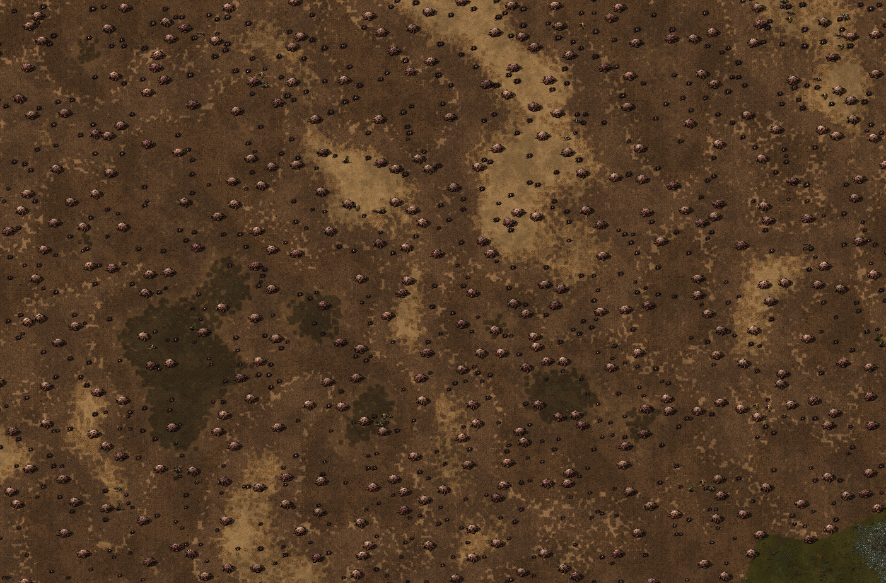

# Biter battles tools
So far this application contains tools to build precomputed lua files for factorio [biter battles](https://github.com/Factorio-Biter-Battles/Factorio-Biter-Battles) scenario, but more is planned.

## Compiling
This is a rust program, you'll need to install rust toolchain first. Follow the steps on [rustup.rs](https://rustup.rs/). Once you have your rust toolchain under PATH, perform the following steps:
``` sh
git clone https://github.com/cogito123/bb-tools
cd bb-tools/
cargo build --release
# final binary will appear in ./target/release/bb
```

## Features
### lua texture
The primary use case of this subcommand is to generate static tiled texture with low computation complexity to substitute expensive runtime noise function.
```
Generate lua texture file using reference image. The image is automatically converted to grayscale.

Usage: bb lua texture [OPTIONS] --steps <steps>... --image <image> --output <output>

Options:
  -s, --steps <steps>...     Range between [0..255] that maps onto name of a factorio tile. The value is derived from grayscale. Format: $tile-name:$x..$y. Multiple space-separated steps can be provided at once. Entire [0..255] range must be covered
  -i, --image <image>        Path of an input image
  -o, --output <output>      Path of a generated lua script
  -b, --blending <blending>  Does a blending noise pass over grayscale. This can help with blending of feature edges. Value is between 0 - 100(%). 0 disables blending pass, 20 makes smooth transitions and 100 is pure randomness [default: 0]
  -x, --seed <seed>          64 bit value that initializes PRNG, 0 - pick random seed [default: 0]
  -h, --help                 Print help
```

#### Example command
Generate lua file from grayscale of a tiling texture. Various thresholds map to different factorio tiles. Additionally `--blending` is provided to smooth out transitions between steps and `--seed` to guarantee reproducibility.
```
bb lua texture --blending 15 --seed 16593722160489474737 --steps sand-3:0..51 sand-1:52..77 sand-3:78..89 dirt-3:90..101 dirt-5:102..129 dirt-2:130..155 dirt-7:156..181 dirt-6:182..207 red-desert-1:208..223 dry-dirt:224..245 grass-4:246..253 grass-3:254..255  --image misc/texture.jpeg --output texture.lua
```
<p align="center">
  
  
</p>
(Entities are not part of the program output)

#### How to integrate with a scenario
The output of the command has the following example structure:
```lua
-- Options that were used to generate this file will appear here.
local mod = {};
mod.width = 512;
mod.height = 512;
mod.map = {
    [n + 1] = "tile-name-0",
    [n + 2] = "tile-name-1",
    [n + 3] = "tile-name-special",
    [n + m] = "...",
};
mod.grid = {
    {n + 1, n + 3, n + 2, ..., n + m},
    {n + 1, n + 3, n + 2, ..., n + m},
    {...},
};
return mod
```
You can use in-game x/y coordinates to modulo with `mod.width` and `mod.height` to obtain row and column offset of `mod.grid`. Values in `grid` cells are indices in `mod.map`. Access `map` value to get name of a tile. The reference usage can be seen [here](https://github.com/Factorio-Biter-Battles/Factorio-Biter-Battles/commit/085f77c2741ad780915b2cadc1b7e756a229f91d#diff-537af0aae2648d23b66bd7d138df6077adab235df9f90e5704bb46d96d7d9ecdR324).
